# PAMS-Verify Results and Figures Summary

## Executive Summary

Final decision: **NO-GO**.

The experiment suite built the requested `pams_verify/` scaffold, registered all experiment folders, ran hardware/memory preflight, collected synthetic trace data, ran offline union/mask/correctness/ablation analyses, ran a CPU reference sparse-kernel microbenchmark, and collected a live vLLM smoke baseline for Qwen3-8B dense and n-gram speculative modes.

The required final condition was not met: there is no real patched-vLLM PAMS sparse-verifier end-to-end run. The installed vLLM 0.20.0 Qwen3-8B path selects `FLASH_ATTN`; the inspected backend forwards normal paged KV `block_table` and sequence lengths into `flash_attn_varlen_func`, but does not expose a request-time arbitrary verifier block-mask API. Integration B therefore did not compile or run a sparse verifier patch.

Top reasons for NO-GO:

1. No real patched-vLLM PAMS end-to-end result is available.
2. Integration B did not compile or run a sparse verifier attention patch.
3. Offline approximate sparse verification has high false accept rate: `14.13%`, far above the `0.1%` GO threshold.

## Environment and Memory

| Item | Value |
|---|---:|
| GPU | NVIDIA GeForce RTX 5090 |
| VRAM | 31.84 GB |
| Driver | 590.48.01 |
| CUDA | 13.1 |
| PyTorch | 2.11.0+cu130 |
| vLLM | 0.20.0 |
| Target model | Qwen/Qwen3-8B |
| Recommended dtype | bfloat16 |
| Estimated model weights | 15.274 GB |
| KV bytes/token | 147,456 |
| KV MiB / 1024 tokens | 144.0 MiB |
| Max KV tokens under 0.85 GPU budget | 58,032 |
| Recommended max_model_len | 4096 |

Memory notes:

- The estimator marks `8192` unsafe for the original `max_num_seqs=16` request.
- `16384` does not have the required 20% headroom and should not be run by default on this 5090 setup.
- OOM degrade order is `max_num_seqs`, then `max_model_len`, then `num_prompts`, then dtype or KV-cache dtype.

## Experiment Status

| Experiment | Status |
|---|---|
| `00_env` | completed |
| `01_dense_baselines` | completed_live_smoke_partial |
| `02_trace_collection` | completed_synthetic_fallback |
| `03_union_problem` | completed_offline_simulation |
| `04_acceptance_prior` | completed_offline_simulation |
| `05_mask_planner_offline` | completed_offline_simulation |
| `06_sparse_kernel_microbench` | completed_cpu_reference_scaled_down |
| `07_vllm_integration_a_scheduler_hook` | attempted_no_live_patch |
| `08_vllm_integration_b_attention_patch` | attempted_unsupported_backend |
| `09_vllm_integration_c_fallback_prefilter` | attempted_offline_prefilter_only |
| `10_end2end` | blocked_no_patched_vllm_sparse_verifier |
| `11_correctness_quality` | completed_offline_synthetic_audit |
| `12_ablations` | completed_offline_simulation |
| `13_failures_oom` | completed_no_oom_observed |

Trace rows:

| Split | Rows |
|---|---:|
| calibration | 9,744 |
| validation | 7,296 |
| test | 7,536 |

## Live vLLM Smoke Baselines

These are real vLLM server runs on Qwen3-8B with `max_model_len=2048`, `max_num_seqs=4`, four random short prompts, and concurrency 1. They are smoke measurements, not the full end-to-end matrix.

| Method | Request throughput req/s | Output throughput tok/s | Mean TTFT ms | Mean ITL ms | Mean E2E latency ms |
|---|---:|---:|---:|---:|---:|
| dense_no_spec | 5.289 | 84.619 | 19.754 | 10.578 | 189.007 |
| ngram_4 | 5.083 | 81.320 | 19.941 | 11.045 | 196.674 |
| ngram_8 | 5.081 | 81.291 | 19.420 | 11.082 | 196.744 |

Conclusion: n-gram speculative decoding was slightly slower than dense on this tiny random smoke workload. No PAMS speedup claim is made.

## Union Problem

Question: do independent sparse masks grow the loaded KV-block union inside one speculative block?

| Method | Avg token blocks | Avg union blocks | Union growth | Jaccard | Target recall | Accepted tokens / loaded block | False accept | False reject |
|---|---:|---:|---:|---:|---:|---:|---:|---:|
| dense_all_blocks | 49.529 | 49.529 | 1.000 | 1.000 | 1.000 | 0.283 | 0.000 | 0.000 |
| independent_topk | 7.121 | 14.008 | 1.863 | 0.580 | 0.764 | 0.329 | 0.254 | 0.044 |
| shared_only | 7.134 | 7.134 | 1.000 | 1.000 | 0.727 | 0.413 | 0.264 | 0.101 |
| shared_fixed_residual | 7.134 | 11.282 | 1.519 | 0.702 | 0.748 | 0.345 | 0.260 | 0.053 |
| pams | 5.465 | 7.926 | 1.425 | 0.742 | 0.632 | 0.401 | 0.214 | 0.085 |
| oracle_shared_residual | 7.126 | 10.242 | 1.390 | 0.764 | 0.873 | 0.361 | 0.361 | 0.000 |

Conclusion: the motivation holds offline. Independent masks nearly double loaded blocks versus per-token mask size (`1.863x` union growth). PAMS lowers average union blocks to `7.926`, but its sparse decision quality remains unacceptable without stronger fallback or exact validation.

### Figures

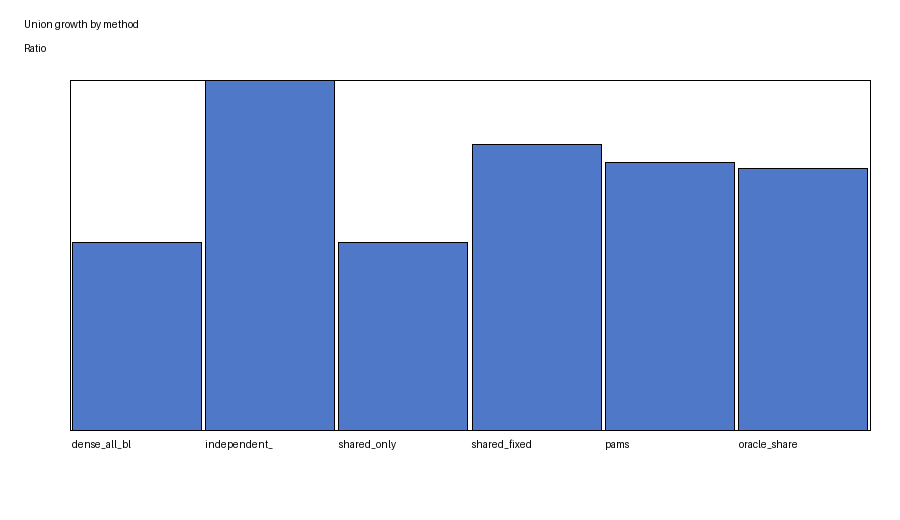

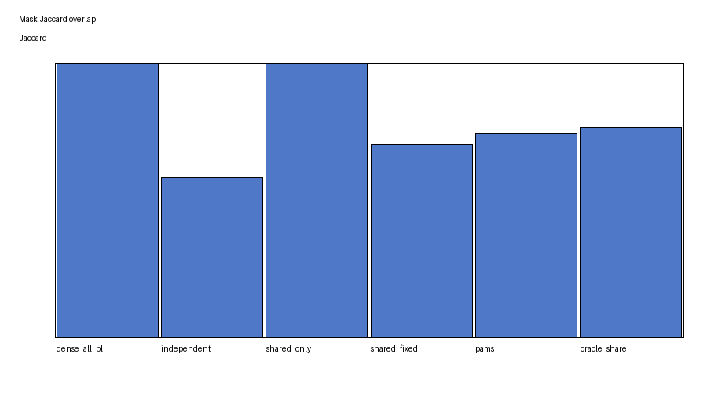

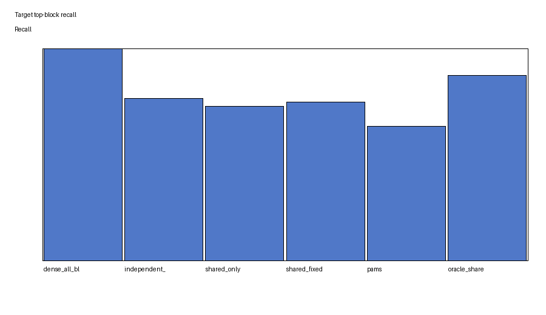

## Acceptance Prior

| Split | ECE | Brier | AUROC accept | Temperature | Bias |
|---|---:|---:|---:|---:|---:|
| calibration | 0.0124 | 0.1877 | 0.7657 | 0.9758 | -0.700 |
| validation | 0.0163 | 0.1872 | 0.7595 | 0.9758 | -0.700 |
| test | 0.0376 | 0.1837 | 0.7627 | 0.9758 | -0.700 |

Additional test metrics:

- `AUROC useful from rho`: `0.7886`
- `rho/useful correlation`: `0.4946`

Conclusion: the acceptance prior has signal in the synthetic traces. Prefix reach probability is predictive enough to justify the offline planner experiment, but this does not establish end-to-end speedup.

### Figures

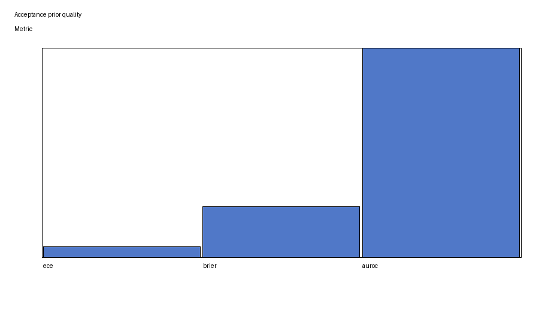

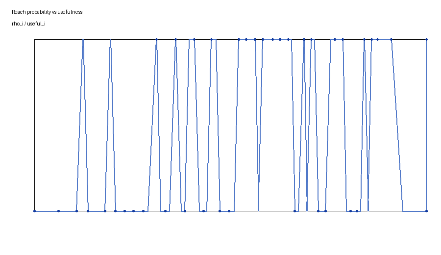

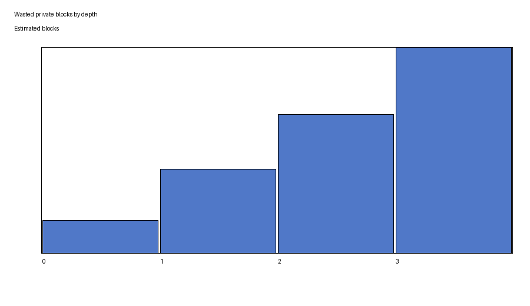

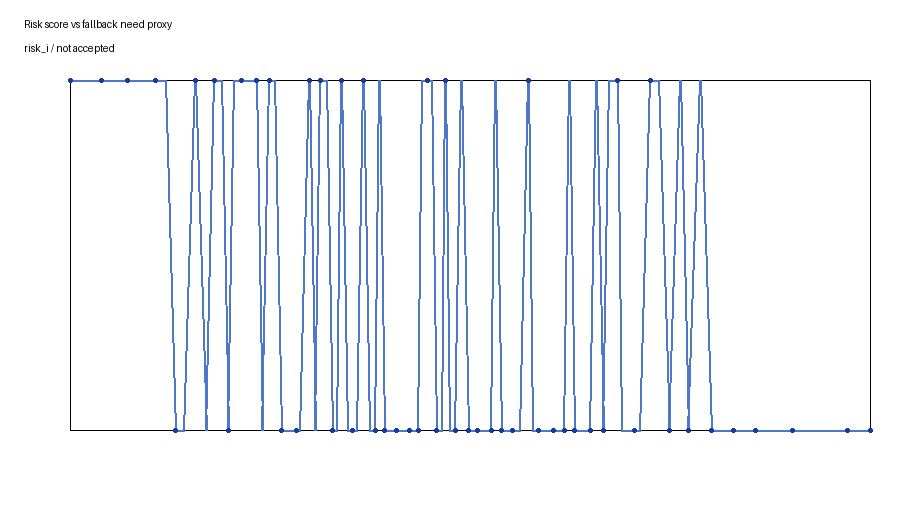

## Offline Mask Planning

| Method | Avg union blocks | Decision match | False accept | False reject | Dense fallback | Accepted tokens / loaded block |
|---|---:|---:|---:|---:|---:|---:|
| dense_all_blocks | 49.529 | 1.000 | 0.000 | 0.000 | 0.000 | 0.283 |
| independent_topk | 14.008 | 0.702 | 0.254 | 0.044 | 0.000 | 0.329 |
| shared_only | 7.134 | 0.634 | 0.264 | 0.101 | 0.000 | 0.413 |
| shared_fixed_residual | 11.282 | 0.688 | 0.260 | 0.053 | 0.000 | 0.345 |
| pams | 7.926 | 0.701 | 0.214 | 0.085 | 0.000 | 0.401 |
| pams_fallback | 7.926 | 0.780 | 0.164 | 0.056 | 0.290 | 0.401 |
| oracle_shared_residual | 10.242 | 0.639 | 0.361 | 0.000 | 0.000 | 0.361 |

Conclusion: PAMS improves the offline accepted-token-per-loaded-block proxy versus dense and independent sparse, but its false accept rate remains much too high. `pams_fallback` improves match rate to `0.780` and lowers false accept to `0.164`, still far above the GO threshold.

### Figures

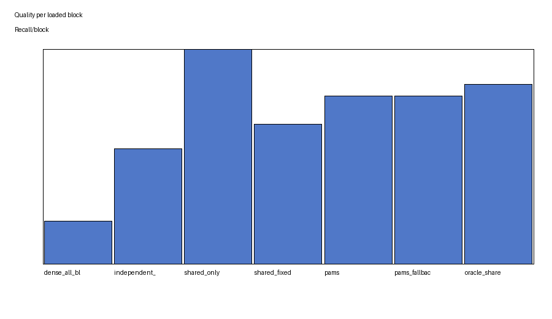

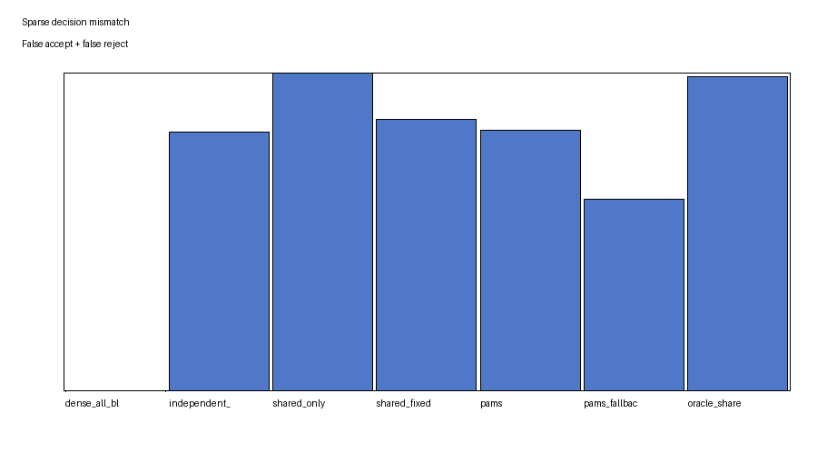

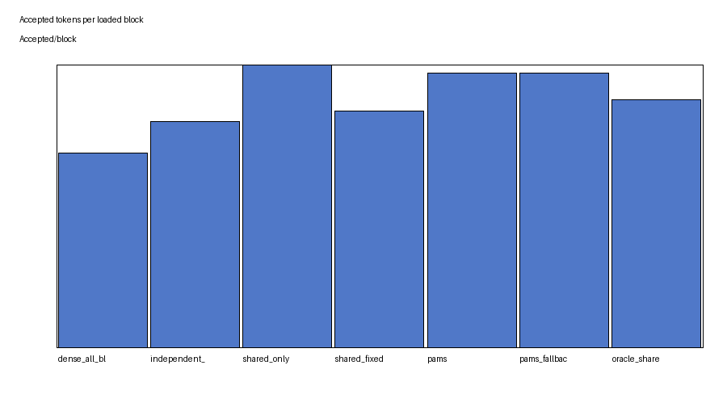

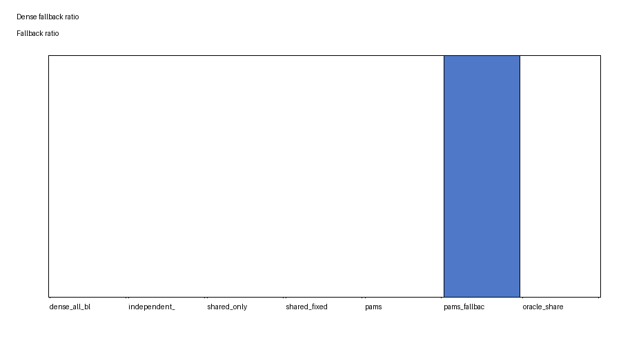

## Sparse Kernel Microbenchmark

This benchmark used a CPU reference path, not a custom GPU Triton kernel. It measures reference overhead only and should not be used as a GPU speedup claim.

| Method | Mean latency ms |
|---|---:|
| dense | 0.106 |
| shared_only | 0.260 |
| pams | 0.280 |
| shared_fixed_residual | 0.294 |
| independent_sparse | 0.348 |

Triton status: `reference_only`; custom Triton sparse attention kernel was not implemented.

### Figure

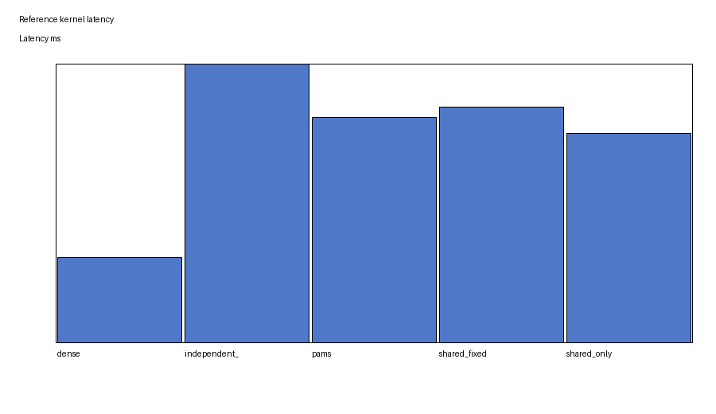

## vLLM Integration Attempts

| Integration | Patched vLLM | Compiled | Live vLLM run | Outcome |
|---|---:|---:|---:|---|
| A scheduler hook | false | false | false | offline policy registered, no live hook |
| B attention patch sparse verifier | false | false | false | unsupported installed backend, no patch applied |
| C sparse prefilter dense fallback | false | false | false | offline prefilter simulation only |

Integration A offline counters:

- Trace rows: `7,536`
- High-risk tokens: `1,830`
- Low-reach suffix tokens: `1,533`

Integration B evidence:

- vLLM version: `0.20.0`
- Package path: `/ACALAB/stu1/miniconda3/envs/spec/lib/python3.12/site-packages/vllm`
- Live Qwen3-8B attention path: `vllm.v1.attention.backends.flash_attn`
- PAMS feature flag found: `false`
- Arbitrary verifier block-mask support found: `false`
- Limitation: current backend supports normal paged KV metadata, not arbitrary PAMS verifier masks.

Integration C offline results:

| Mode | Decision match | False accept | False reject | Dense fallback |
|---|---:|---:|---:|---:|
| approximate_fallback | 0.810 | 0.105 | 0.085 | 0.290 |
| exact_fallback | 1.000 | 0.000 | 0.000 | 1.000 |

Conclusion: Integration C exact mode is exact only because every committed token is dense-verified, which removes the sparse-verifier speedup claim. Approximate mode still has high false accept rate.

## End-to-End Matrix

The full end-to-end matrix was registered but PAMS methods were blocked because no patched sparse verifier exists.

Registered workloads:

- `short_chat`
- `short_mtbench_like`
- `medium_sharegpt_like`
- `long_rag_4k`
- `long_output`
- `mixed_5090_safe`

Registered method families:

- Dense and standard vLLM baselines were registered.
- `independent_sparse_verifier`, `shared_fixed_residual`, `pams`, `pams_fallback_exact`, and `pams_fallback_approximate` are all `blocked_no_patched_vllm_sparse_verifier`.

No PAMS end-to-end throughput or ITL claim is made.

### Figures

These figures exist for report completeness, but they do not contain a positive PAMS end-to-end result.

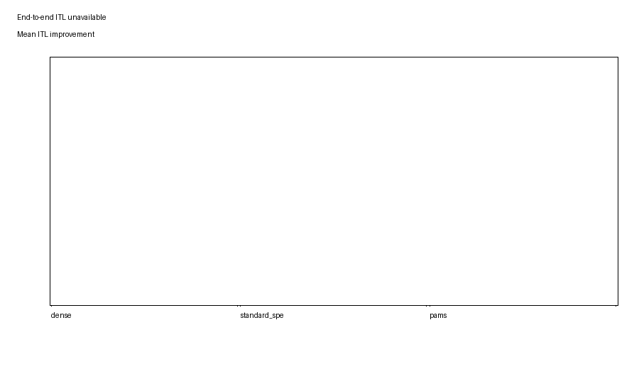

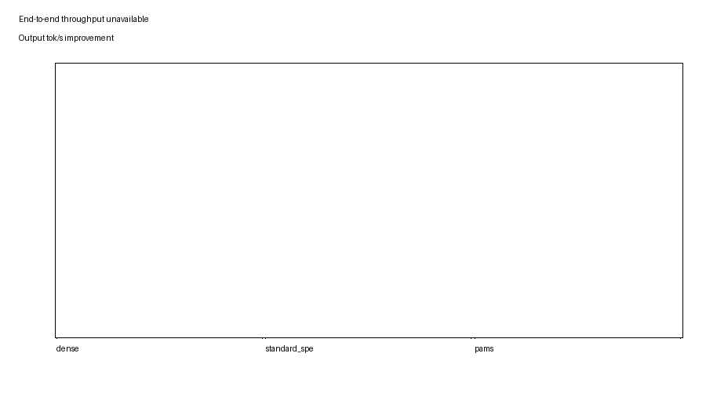

## Correctness and Quality

| Mode | Decision match | False accept | False reject | Dense fallback | Greedy token-ID exact match |
|---|---:|---:|---:|---:|---|
| approximate_sparse | 0.723 | 0.141 | 0.136 | 0.000 | false |
| exact_fallback | 1.000 | 0.000 | 0.000 | 1.000 | true |

Quality metrics were not available, so no task-quality claim is made. False accept examples are stored in `experiments/11_correctness_quality/parsed/correctness_metrics.json`.

### Figure

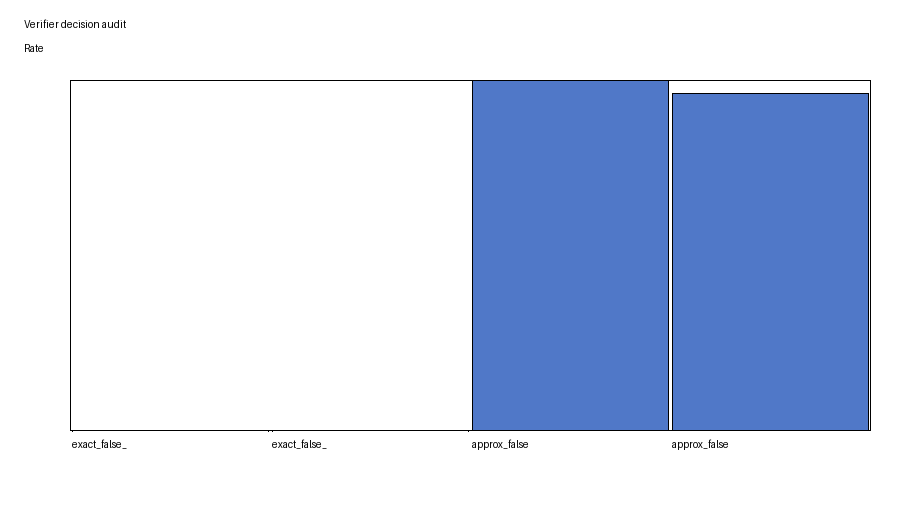

## Ablations

| Ablation | Avg loaded blocks | Decision match | False accept | False reject | Dense fallback |
|---|---:|---:|---:|---:|---:|
| no_acceptance_prior | 7.340 | 0.777 | 0.159 | 0.064 | 0.290 |
| no_reach_probability | 7.326 | 0.775 | 0.162 | 0.064 | 0.290 |
| no_risk_term | 7.143 | 0.782 | 0.158 | 0.060 | 0.290 |
| shared_only | 7.134 | 0.634 | 0.264 | 0.101 | 0.000 |
| independent_topk | 14.008 | 0.702 | 0.254 | 0.044 | 0.000 |
| fixed_residual | 11.282 | 0.688 | 0.260 | 0.053 | 0.000 |
| no_fallback | 7.926 | 0.701 | 0.214 | 0.085 | 0.000 |
| dense_fallback_all_early | 7.926 | 1.000 | 0.000 | 0.000 | 1.000 |

Conclusion: offline ablations show fallback is the dominant correctness lever. The acceptance-prior/reach/risk variants are not strong enough here to meet correctness thresholds without dense verification.

### Figure

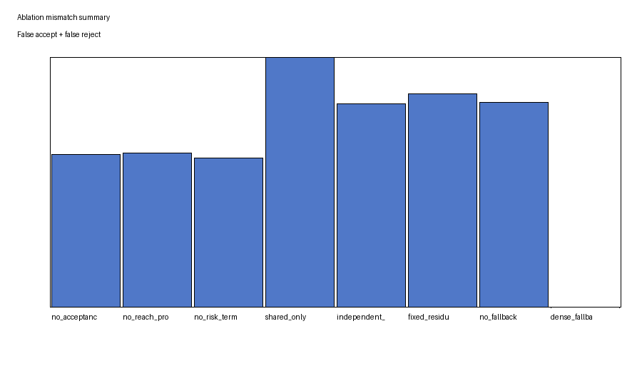

## Failure Log

Current top-level failures:

- `07_vllm_integration_a_scheduler_hook`: `attempted_no_live_patch`
- `08_vllm_integration_b_attention_patch`: `attempted_unsupported_backend`
- `09_vllm_integration_c_fallback_prefilter`: `attempted_offline_prefilter_only`
- `10_end2end`: `blocked_no_patched_vllm_sparse_verifier`

Older baseline registration failures recorded `vllm command not found` before the later live smoke script used the `spec` environment path and successfully ran dense/ngram smoke baselines.

## Final Judgment

This is not a GO systems result. The strongest defensible statement is:

> PAMS-Verify is an offline research prototype showing that independent per-draft-token sparse masks create KV-block union growth, and that shared/residual planning can improve an accepted-token-per-loaded-block proxy on synthetic traces.

The current evidence does not support an end-to-end vLLM speedup or a correctness-safe approximate sparse verifier. The next engineering step is to use an editable vLLM source checkout and first implement a minimal exact scheduler hook; after that, prototype an attention backend that can consume per-request verifier block masks.
