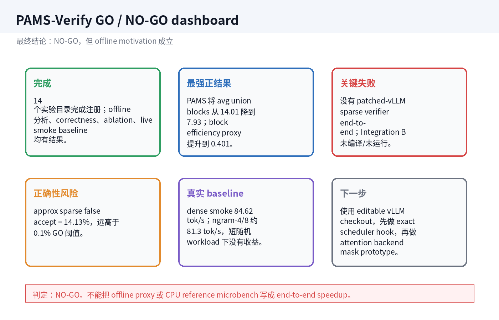
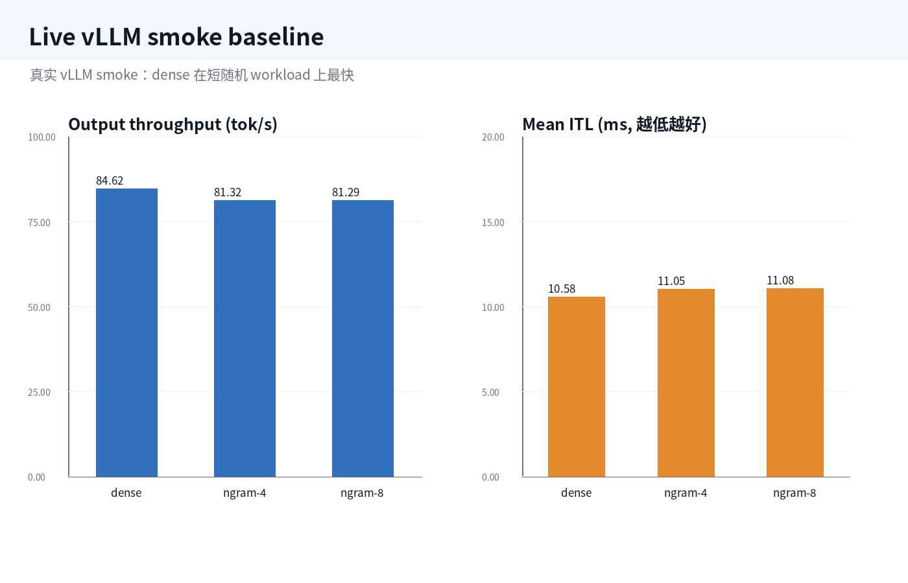
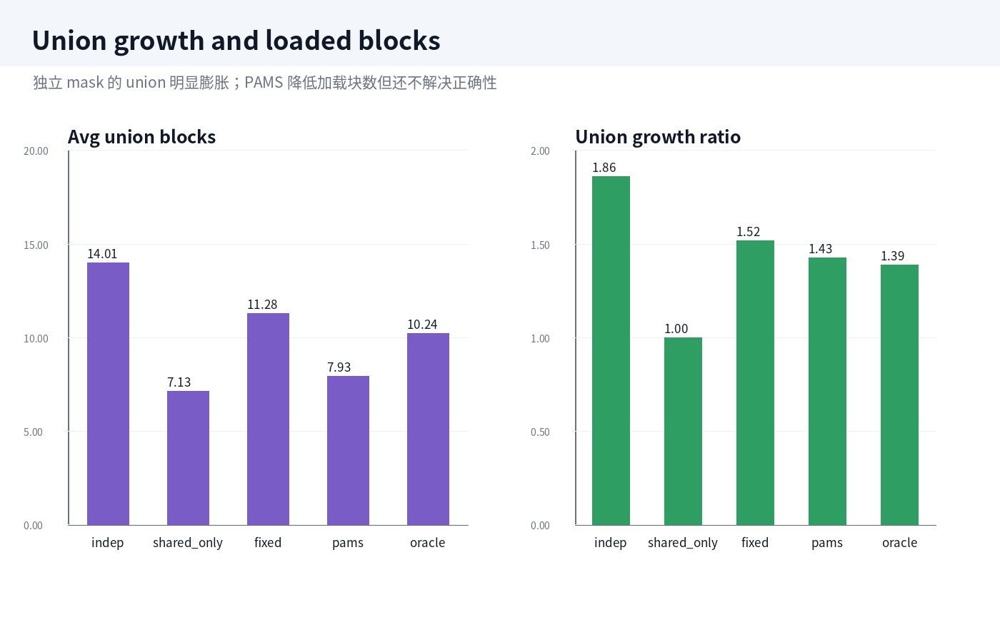
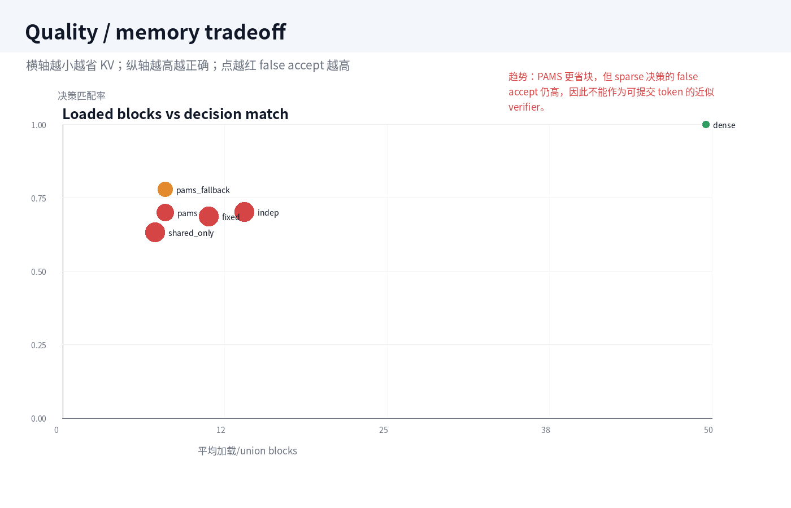
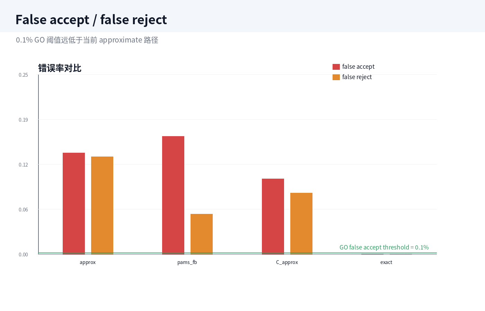
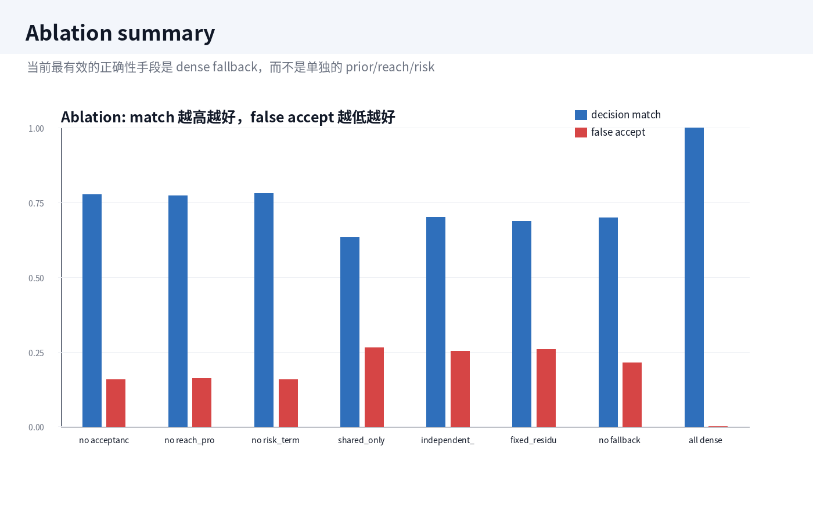

# PAMS-Verify 中文结果汇总与趋势结论

## 1. 一页式结论

最终判定：**NO-GO**。

这轮工作已经完成了 `pams_verify/` 实验框架、硬件/显存预检、synthetic trace、offline union/mask/correctness/ablation 分析、CPU reference sparse-kernel microbenchmark，以及真实 vLLM dense/ngram smoke baseline。

但是最终系统结论不成立：当前没有真实 patched-vLLM PAMS sparse verifier end-to-end 结果。vLLM 0.20.0 在 Qwen3-8B 上走 `FLASH_ATTN`，该路径只有常规 paged KV `block_table` / sequence length 元数据，没有 per-request arbitrary verifier block-mask API。因此 Integration B 没有编译、没有运行，也没有 end-to-end speedup。

**核心趋势：**

- 独立 sparse mask 会造成明显 union 膨胀：`independent_topk` 的 union growth ratio 是 `1.863x`。
- PAMS 能显著减少 loaded blocks：avg union blocks 从 independent 的 `14.008` 降到 `7.926`。
- PAMS 的 block efficiency proxy 更好：accepted tokens / loaded block 达到 `0.401`。
- 但 sparse verifier 正确性不过关：approximate sparse false accept 是 `14.13%`，远高于 `0.1%` GO 阈值。
- 真实 vLLM smoke baseline 中，dense 比 ngram-4/8 略快；没有任何 PAMS end-to-end 加速结果。

## 2. 环境与显存约束

| 项目 | 数值 |
|---|---:|
| GPU | NVIDIA GeForce RTX 5090 |
| VRAM | 31.84 GB |
| Driver | 590.48.01 |
| CUDA | 13.1 |
| PyTorch | 2.11.0+cu130 |
| vLLM | 0.20.0 |
| Target model | Qwen/Qwen3-8B |
| 推荐 dtype | bfloat16 |
| 估算权重显存 | 15.274 GB |
| KV bytes/token | 147456 |
| 推荐 max_model_len | 4096 |

趋势和结论：

- RTX 5090 32GB 对 Qwen3-8B BF16 是可跑但紧张的配置。
- 8192/16384 不能默认放开，需要按 estimator 降低 `max_num_seqs` 或先跑 smoke。
- 本轮真实 vLLM smoke 使用更保守的 `max_model_len=2048`、`max_num_seqs=4`。

## 3. Live vLLM smoke baseline

| 方法 | req/s | output tok/s | TTFT ms | ITL ms | E2E ms |
|---|---:|---:|---:|---:|---:|
| `dense_no_spec` | 5.289 | 84.619 | 19.754 | 10.578 | 189.007 |
| `ngram_4` | 5.083 | 81.320 | 19.941 | 11.045 | 196.674 |
| `ngram_8` | 5.081 | 81.291 | 19.420 | 11.082 | 196.744 |

趋势和结论：

- dense_no_spec: `84.619 tok/s`，mean ITL `10.578 ms`。
- ngram-4/8: 都约 `81.3 tok/s`，mean ITL 约 `11.0 ms`。
- 在这个短随机 smoke workload 上，ngram speculative 没有带来收益，反而略慢。
- 这只是 baseline smoke，不是完整 end-to-end matrix。

## 4. Union problem：动机是否成立

| 方法 | avg union blocks | union growth | decision match | false accept | accepted tokens / loaded block |
|---|---:|---:|---:|---:|---:|
| `dense_all_blocks` | 49.529 | 1.000 | 1.000 | 0.00% | 0.283 |
| `independent_topk` | 14.008 | 1.863 | 0.702 | 25.38% | 0.329 |
| `shared_only` | 7.134 | 1.000 | 0.634 | 26.45% | 0.413 |
| `shared_fixed_residual` | 11.282 | 1.519 | 0.688 | 25.96% | 0.345 |
| `pams` | 7.926 | 1.425 | 0.701 | 21.43% | 0.401 |
| `oracle_shared_residual` | 10.242 | 1.390 | 0.639 | 36.11% | 0.361 |

原始实验图：

趋势和结论：

- `independent_topk` 每个 token 平均只看 `7.121` 个 blocks，但 speculative block 的 union 达到 `14.008`，说明独立 mask 的复用性差。
- `shared_only` 的 union 最小，但 recall 和 correctness 更差。
- `PAMS` 在 loaded blocks 和 proxy efficiency 上更好，但 target attention recall 和 false accept 仍然不安全。
- 结论：**PAMS 的问题动机成立，但正确性还没有解决。**

## 5. Acceptance prior：是否有可用信号

| Split | ECE | Brier | AUROC accept | Temperature |
|---|---:|---:|---:|---:|
| calibration | 0.0124 | 0.1877 | 0.7657 | 0.9758 |
| validation | 0.0163 | 0.1872 | 0.7595 | 0.9758 |
| test | 0.0376 | 0.1837 | 0.7627 | 0.9758 |

趋势和结论：

- test AUROC accept 是 `0.7627`，说明 draft-side prior 有一定预测能力。
- `rho` 对 useful token 的 AUROC 是 `0.7886`，比单纯 acceptance prior 更贴近“哪些 token 值得分配 verifier budget”。
- 但这只是 offline trace 信号，不能直接证明 end-to-end 加速。

## 6. Offline mask planner：省 block 与正确性的 tradeoff

| 方法 | avg union blocks | decision match | false accept | false reject | dense fallback | accepted tokens / loaded block |
|---|---:|---:|---:|---:|---:|---:|
| `dense_all_blocks` | 49.529 | 1.000 | 0.00% | 0.00% | 0.00% | 0.283 |
| `independent_topk` | 14.008 | 0.702 | 25.38% | 4.38% | 0.00% | 0.329 |
| `shared_only` | 7.134 | 0.634 | 26.45% | 10.12% | 0.00% | 0.413 |
| `shared_fixed_residual` | 11.282 | 0.688 | 25.96% | 5.28% | 0.00% | 0.345 |
| `pams` | 7.926 | 0.701 | 21.43% | 8.51% | 0.00% | 0.401 |
| `pams_fallback` | 7.926 | 0.780 | 16.43% | 5.59% | 28.98% | 0.401 |
| `oracle_shared_residual` | 10.242 | 0.639 | 36.11% | 0.00% | 0.00% | 0.361 |

趋势和结论：

- `PAMS` 的 avg union blocks 是 `7.926`，比 `independent_topk` 的 `14.008` 低很多。
- `PAMS` 的 accepted tokens / loaded block 是 `0.401`，proxy 上优于 dense 和 independent。
- 但 `PAMS` false accept 是 `21.43%`；`pams_fallback` 也仍有 `16.43%` false accept。
- 结论：**offline memory proxy 有改善，但 verifier correctness 不可接受。**

## 7. Correctness：最终失败的关键

| 模式 | decision match | false accept | false reject | dense fallback | greedy token-ID exact |
|---|---:|---:|---:|---:|---|
| approximate_sparse | 0.723 | 14.13% | 13.57% | 0.00% | false |
| exact_fallback | 1.000 | 0.00% | 0.00% | 100.00% | true |

趋势和结论：

- approximate sparse 的 false accept 是 `14.13%`，这是系统论文 claim 的硬失败点。
- exact fallback 能做到 token-ID exact，但 dense fallback rate 是 `100%`，因此没有 sparse verifier 节省。
- 当前不能声称 approximate sparse verifier 是质量安全的。

## 8. Sparse kernel microbenchmark

| 方法 | mean latency ms |
|---|---:|
| dense | 0.106 |
| shared_only | 0.260 |
| pams | 0.280 |
| shared_fixed_residual | 0.294 |
| independent_sparse | 0.348 |

趋势和结论：

- 本轮是 CPU reference path，不是 GPU Triton kernel。
- sparse reference 比 dense reference 更慢，说明当前 microbench 只能说明实现开销，不能作为 GPU 加速证据。
- 自定义 Triton sparse attention kernel 未实现。

## 9. vLLM integration：为什么没跑通 PAMS end-to-end

| Integration | patched vLLM | compiled | live vLLM | outcome |
|---|---:|---:|---:|---|
| A scheduler hook | false | false | false | offline policy only |
| B attention sparse verifier | false | false | false | unsupported backend, no patch applied |
| C fallback prefilter | false | false | false | offline simulation only |

Integration B 关键事实：

- vLLM package: `/ACALAB/stu1/miniconda3/envs/spec/lib/python3.12/site-packages/vllm`
- vLLM version: `0.20.0`
- PAMS feature flag present: `False`
- arbitrary block mask supported: `False`
- limitation: `Installed vLLM does not expose an arbitrary verifier block-mask path; patching site-packages was not performed from the shared sandbox.`

趋势和结论：

- A/C 都只是 offline policy，不满足 final GO。
- B 是最关键路径，但当前 installed vLLM 后端没有 arbitrary verifier mask 接口。
- 因此 end-to-end matrix 中所有 PAMS 方法都被标记为 `blocked_no_patched_vllm_sparse_verifier`。

## 10. Ablation：哪些因素真正有效

| ablation | avg loaded blocks | decision match | false accept | false reject | dense fallback |
|---|---:|---:|---:|---:|---:|
| `no_acceptance_prior` | 7.340 | 0.777 | 15.88% | 6.38% | 28.98% |
| `no_reach_probability` | 7.326 | 0.775 | 16.18% | 6.36% | 28.98% |
| `no_risk_term` | 7.143 | 0.782 | 15.83% | 5.98% | 28.98% |
| `shared_only` | 7.134 | 0.634 | 26.45% | 10.12% | 0.00% |
| `independent_topk` | 14.008 | 0.702 | 25.38% | 4.38% | 0.00% |
| `fixed_residual` | 11.282 | 0.688 | 25.96% | 5.28% | 0.00% |
| `no_fallback` | 7.926 | 0.701 | 21.43% | 8.51% | 0.00% |
| `dense_fallback_all_early` | 7.926 | 1.000 | 0.00% | 0.00% | 100.00% |

趋势和结论：

- `dense_fallback_all_early` 正确性最好，但本质上回到了 dense verification。
- `no_fallback` false accept 仍有 `21.43%`。
- 去掉 acceptance prior / reach probability / risk term 后，结果没有出现决定性崩溃，说明当前 synthetic setup 中这些项还不是强证据。
- 结论：**fallback 是当前正确性的主导因素，PAMS 的 prior/reach/risk 还没有证明为 end-to-end 必要组件。**

## 11. 最终判断

这轮结果最合理的表述是：

> PAMS-Verify 目前是一个 offline research prototype。它证明了 independent per-token sparse masks 会导致 KV block union growth，也显示 shared/residual planning 能改善 accepted-token-per-loaded-block 这个 proxy。但它还没有证明真实 vLLM end-to-end speedup，也没有证明 approximate sparse verifier 的正确性安全。

不能声称：

- PAMS 已经实现 end-to-end 加速。
- 当前 sparse verifier 可以安全提交 token。
- CPU reference microbenchmark 代表 GPU kernel speedup。
- offline loaded-block proxy 等价于系统吞吐提升。

下一步建议：

1. 使用 editable vLLM source checkout。
2. 先实现 Integration A 的 exact scheduler hook，建立一个可跑通的 exact live baseline。
3. 再实现 attention backend mask prototype，让 verifier attention 能接收 per-request PAMS block mask。
4. 最后重新跑 long_rag_4k/8k end-to-end，并以 false accept `<0.1%` 作为硬门槛。
